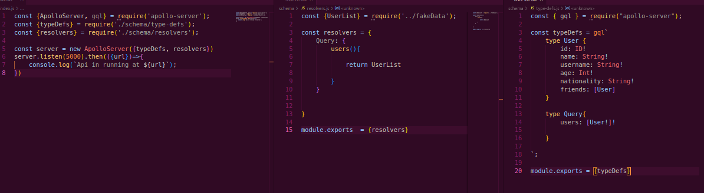

# GraphQL Tutorial

Welcome to the GraphQL tutorial! This tutorial is designed to introduce you to the basics of GraphQL, including what it is, how it compares to REST, and how to get started with building your own GraphQL API.

## Table of Contents

- [What is GraphQL?](#what-is-graphql)
- [Why GraphQL?](#why-graphql)
- [Getting Started](#getting-started)
  - [Installation](#installation)
  - [Creating a GraphQL Server](#creating-a-graphql-server)
  - [Defining a Schema](#defining-a-schema)
  - [Running Queries](#running-queries)
- [GraphQL vs REST](#graphql-vs-rest)
- [Resources](#resources)

## What is GraphQL?

GraphQL is a query language for your API, and a runtime for executing those queries by using a type system you define for your data. It was developed by Facebook and released as an open-source project in 2015.

## Why GraphQL?

- **Efficient Data Loading:** With GraphQL, you can fetch all the required data in a single request, reducing the number of network round trips.
- **Client-Specified Queries:** Clients can request only the data they need, which can lead to faster and more efficient applications.
- **Strongly Typed Schema:** GraphQL APIs are defined by a schema, which allows for better validation and type checking.

## Getting Started

### Installation

To get started with GraphQL, you'll need to install the necessary packages. If you're using Node.js, you can install the `graphql` package using npm or yarn:

```bash
npm install graphql
# or
yarn add graphql
```

### Creating a GraphQL Server

You can create a GraphQL server using libraries like `apollo-server` or `express-graphql`. Here's a basic example using `apollo-server`:

```javascript
const { ApolloServer, gql } = require('apollo-server');

// Define your schema
const typeDefs = gql`
  type Query {
    hello: String
  }
`;

// Provide resolver functions for your schema fields
const resolvers = {
  Query: {
    hello: () => 'Hello world!',
  },
};

// Create an instance of ApolloServer
const server = new ApolloServer({ typeDefs, resolvers });

// Start the server
server.listen().then(({ url }) => {
  console.log(`Server ready at ${url}`);
});

## Example:

```

### Defining a Schema

In the example above, we defined a simple schema with a single `Query` type and a `hello` field that returns a string.

### Running Queries

Once your server is running, you can use a tool like GraphQL Playground or GraphiQL to send queries to your server. Here's an example query:

```graphql
query {
  hello
}
```

This query should return the string `'Hello world!'`.

## GraphQL vs REST

GraphQL and REST are both API design architectures, but they differ in several key ways. Here are some differences:

- **Data Fetching:** GraphQL allows clients to request only the data they need, while REST requires multiple endpoints for different resources.
- **Schema Definition:** GraphQL APIs are defined by a schema, which provides a strongly typed contract for clients. REST APIs do not have a built-in schema.
- **Flexibility:** GraphQL provides more flexibility for clients to request exactly the data they need, while REST endpoints are fixed.

## Resources

- [Official GraphQL Documentation](https://graphql.org/)
- [Apollo GraphQL Documentation](https://www.apollographql.com/docs/)
- [GraphQL vs REST](https://www.apollographql.com/blog/graphql-vs-rest-5d425123e34b/)# graphql101
